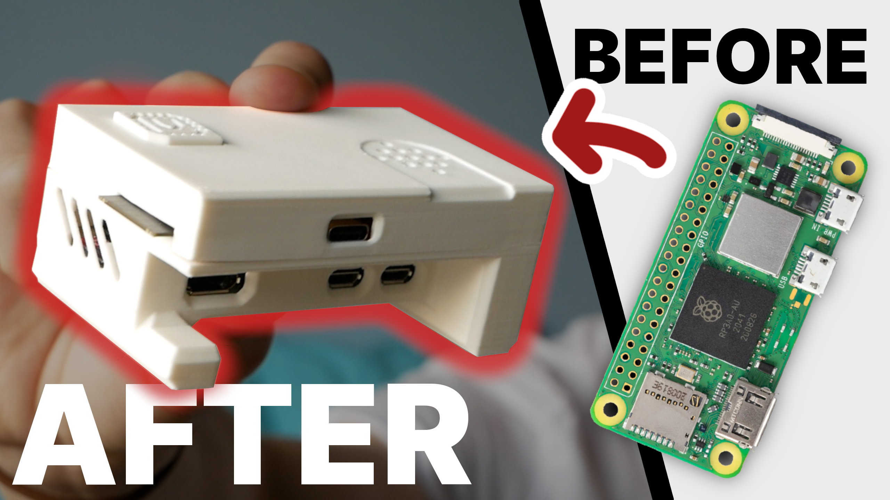

[See the build and design on YouTube!](https://www.youtube.com/watch?v=XNRuj0vmZO0)

# Nevolta Nexus

The Nexus is a **retro games console** based on the Raspberry Pi Zero 2W and the ESP32-S3. The console features:
- Custom wireless controller
- Active cooling system
- Custom PCBs
- Fully open source design

"Nevolta" is the name for my personal console line-up. **(more are coming soon!)**

# Files

- The "Printables" folder contains labeled 3D printable files for the Console unit as well as the Controller.
- The "PCBs" folder contains GERBER files, as well as KiCad project, schematic, and layout files.
- The "Firmware" folder contains two .INO files for the Console and Controller ESPs, respectively.

# Setup

## ESP32-S3 Microcontrollers
- The ESPs can be programmed when already soldered onto the board, since a data connection is present in the USB-C connector.
- Respective firmware (.INO) files are to be flashed via the [Arduino IDE](https://www.arduino.cc/en/software/)

## Raspberry Pi Zero 2W
- A generic RetroPie build is used for the Pi, which is included in the [Raspberry Pi Imager](https://www.raspberrypi.com/software/)
- Software [GPIOnext](https://github.com/mholgatem/GPIOnext) is used for GPIO button usage according to the instructions provided on the repo.
- [This tutorial](https://www.youtube.com/watch?v=BV_nVu8Be7M) is a good reference for the setup of the software.